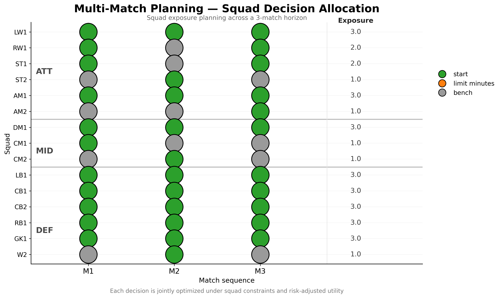
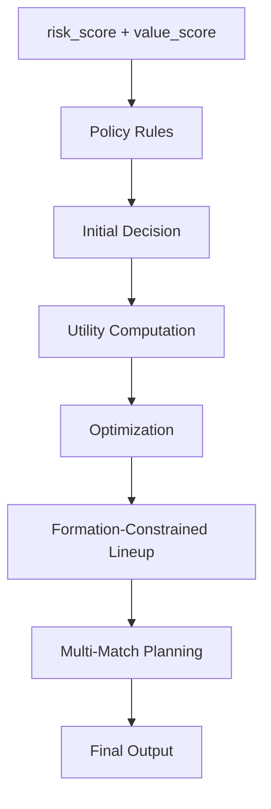

# Football Decision Engine

### A decision intelligence system for managing player risk, performance and exposure under real-world football constraints.

> Transforming predictive signals into **optimal squad decisions** through risk-aware optimization and multi-match planning.

---


---

## 🚀 From Prediction → Decision → Optimization → Action

This project implements a **Decision Intelligence system** designed to support football clubs in translating predictive signals into **optimal squad-level decisions**.

Unlike traditional analytics pipelines, this system does not stop at estimating:

- player performance
- injury risk

Instead, it answers the operational question:

> **Given all available information, what should we do?**

---

## 📊 Executive Summary

The Football Decision Engine integrates:

- player value (performance contribution)
- availability risk (injury / exposure)
- squad-level constraints
- tactical structure
- match context across a planning horizon

to produce **actionable, explainable and optimized decisions**:

- `start`
- `limit_minutes`
- `bench`

These decisions are not made independently.

They are allocated through a **global optimization process** that ensures consistency across the entire squad, from player-level actions to formation-constrained lineups and multi-match exposure planning.

---

## 📊 Key Results

- End-to-end **decision system (not just models)**
- Config-driven **MILP optimization layer**
- Multi-match planning under congestion
- Interpretable outputs (`decision`, `reason`, `priority_score`)
- Modular architecture ready for extension (uncertainty, tactics)

---

## 🧠 Why This Matters (Elite Football Context)

In professional football environments:

- key players operate under injury risk
- match congestion forces trade-offs across games
- decisions must balance performance, availability and long-term exposure

However, most analytics systems stop at:

- estimating performance
- quantifying risk

They do not answer:

> **What is the optimal decision at squad level?**

This project addresses that gap by formalizing decision-making as an optimization problem.

---

## ⭐ Key Features

| Feature | Description |
|--------|------------|
| Decision Engine | Converts predictive signals into optimized squad decisions |
| Policy-driven | Fully configurable thresholds & rules |
| MILP Optimization | Globally optimal decision allocation |
| Risk-aware utility | Explicit trade-off between performance and availability |
| Explainability | Human-readable reasoning for each decision |
| Lineup Optimization | Formation-constrained starting XI |
| Multi-Match Planning | Horizon-aware exposure allocation under congestion |
| Config-driven MILP | Fully parameterized optimization layer (no hardcoded logic) |

---

## 🛠 Tech Stack

| Layer | Tech |
|------|------|
| Language | Python |
| Data | pandas |
| Optimization | PuLP (MILP), SciPy |
| Config | JSON |
| Architecture | Modular / production-style |

---

## 📑 Table of Contents

- 📚 [Documentation](#-documentation)
- 📄 [Case Study](#-case-study)
- 🎯 [Demo](#-demo)
- ⚡ [Quick Start](#-quick-start)
- 🧠 [Project Objective](#-project-objective)
- ⚽ [Real-world Use Case (Matchday Scenario)](#-real-world-use-case-matchday-scenario)
- 📊 [Notebooks (Progressive Demonstrations)](#-notebooks-progressive-demonstrations)
- 🔢 [V0.8 — Multi-Match Planning](#-v08--multi-match-planning)
- 🏗 [System Architecture](#-system-architecture)
- ⚙ [Decision Flow](#-decision-flow)
- 🧩 [Component Responsibilities](#-component-responsibilities)
- 📁 [Project Structure](#-project-structure)
- 📥 [Input Output](#-input-output)
- ⚠ [Limitations](#-limitations)
- 🚀 [Future Improvements](#-future-improvements)
- 🎯 [Why This Project](#-why-this-project)
- 👤 [Author](#-author)
- 📜 [License](#-license)

---

## 📚 Documentation

- [System Architecture](docs/architecture.md)
- [Decision Logic](docs/decision_logic.md)
- [Optimization Layer](docs/optimization.md)
- [Multi-Match Planning](docs/multi_match_planning.md)

---

## 📄 Case Study

A realistic match congestion scenario showing how the system supports squad-level decision-making:

👉 [Read full case study](docs/case_study.md)

---

## 🎯 Demo

The following examples illustrate how the system evolves from player-level evaluation to full squad planning under realistic constraints.

### 1. Player decision space (risk vs value)


Players are evaluated based on:

- `risk_score`
- `value_score`

This defines the initial decision policy:

- `start`
- `limit_minutes`
- `bench`

### 2. Optimized lineup under constraints


The system builds an optimal XI considering:

- formation constraints (4-3-3)
- positional eligibility
- player utility
- risk management

### 3. Multi-match planning under congestion



Across multiple matches, the system:

- allocates player exposure
- manages fatigue accumulation
- rotates squad intelligently
- adapts to match importance

The result is not just a lineup, but a **planning strategy across matches**.

---

## ⚡ Quick Start

### 1. Clone the repository

```bash
git clone https://github.com/manuelpeba/football-decision-engine.git
cd football-decision-engine
```

### 2. Create environment

```bash
python -m venv .venv
source .venv/bin/activate   # macOS / Linux
.venv\Scripts\activate      # Windows
```

### 3. Install dependencies

```bash
pip install -r requirements.txt
```

### 4. Run notebooks (recommended)

Start with:

```bash
jupyter notebook
```

Run in order:

1. `01_decision_boundary_elite.ipynb`
2. `02_matchday_simulation_elite.ipynb`
3. `03_lineup_optimization_elite.ipynb`
4. `04_multi_match_planning_elite.ipynb`

### Minimal run (no notebooks)

```bash
PYTHONPATH=src python run.py
```

### 🧪 What you will see

- Player-level decision logic
- Matchday simulation
- Optimized starting XI
- Multi-match exposure planning
- Fatigue-aware squad management

---

## 🧠 Project Objective

Move from:

**Prediction → Decision**

Instead of building isolated models, this project focuses on:

- decision systems
- trade-off modeling
- optimization under constraints

---

## ⚽ Real-world Use Case (Matchday Scenario)

A club is preparing for a high-intensity match with:

- a key attacker with high injury risk
- several rotation players
- limited starting slots
- match congestion in upcoming fixtures

The staff must decide:

- who starts
- who is protected
- how to manage exposure

The engine evaluates each player using:

- `risk_score`
- `value_score`

and produces decisions such as:

| Player Profile | Decision |
|---------------|---------|
| High value + high risk | `limit_minutes` |
| High value + low risk | `start` |
| Low value | `bench` |

All decisions are optimized **jointly**, not individually.

---

## 📊 Notebooks (Progressive Demonstrations)

The project includes a set of notebooks that illustrate the evolution of the system from simple decision rules to horizon-aware planning:

| Notebook | Focus |
|--------|------|
| `01_decision_boundary_elite.ipynb` | Risk vs value decision space |
| `02_matchday_simulation_elite.ipynb` | Policy-based matchday decisions |
| `03_lineup_optimization_elite.ipynb` | Formation-constrained optimization |
| `04_multi_match_planning_elite.ipynb` | Multi-match planning under congestion |

These notebooks are not independent analyses, but **progressive layers of the same decision system**.

---

## 🔢 V0.8 — Multi-Match Planning

The system has been extended from single-match optimization to **multi-match planning under congestion**.

Instead of optimizing decisions in isolation, the engine now allocates player exposure across a sequence of matches with different:

- match importance
- opponent strength
- recovery windows

### ⚙️ Planning Objective

Move from:

**Match-level optimization → Horizon-level planning**

The system decides:

- who starts each match
- who is protected (`limit_minutes`)
- who is benched strategically
- how fatigue evolves across the sequence

### 🔁 Exposure Allocation

Each player is assigned one of:

| Decision | Meaning |
|--------|--------|
| `start` | Full exposure |
| `limit_minutes` | Controlled load |
| `bench` | No exposure |

These decisions are optimized **jointly across matches**, not independently.

### 🧠 Key Behaviors

The system learns structurally different strategies per unit:

- **Goalkeeper** → deterministic (fixed starter)
- **Defence** → stability (binary decisions)
- **Midfield** → load balancing (frequent partial exposure)
- **Attack** → risk-managed allocation (rotation + protection)

### 📊 Example Outcome

Across a three-match horizon:

- core players maintain consistent exposure
- high-risk attackers are selectively protected
- lower-priority matches absorb rotation
- fatigue accumulates and influences later decisions

### 🧱 System Evolution

The project now follows a clear progression:

`Prediction → Policy → Matchday Optimization → Multi-Match Planning`

This final layer transforms the system into a **Football Decision Intelligence Engine**.

---

## 🏗 System Architecture


This architecture ensures a clear separation between:

- **policy definition** (how players are evaluated)
- **decision logic** (how actions are derived)
- **optimization layer** (how decisions are allocated globally)

This mirrors real-world football decision workflows across performance, medical and coaching staff.

---

## ⚙ Decision Flow



---

## 🧩 Component Responsibilities

| Component | Responsibility |
| ----------------- | ------------------------- |
| `engine.py` | Orchestration |
| `decision.py` | Rule-based classification |
| `policies.py` | Config validation |
| `constraints.py` | Squad constraints |
| `optimizer_milp.py` | Global optimization |
| `notebooks/` | Progressive demonstrations of the system |
| `docs/` | Technical and conceptual documentation |
| `assets/demo/` | README demo visuals |

---

## 📁 Project Structure

```bash
assets/
└── demo/
    ├── decision_space.png
    ├── optimized_lineup_M1.png
    └── multi_match_planning.png

docs/
├── architecture.md
├── decision_logic.md
├── optimization.md
├── multi_match_planning.md
└── case_study.md

notebooks/
├── README.md
├── 01_decision_boundary_elite.ipynb
├── 02_matchday_simulation_elite.ipynb
├── 03_lineup_optimization_elite.ipynb
└── 04_multi_match_planning_elite.ipynb

src/
└── football_decision_engine/
    ├── __init__.py
    ├── engine.py
    ├── decision.py
    ├── policies.py
    ├── constraints.py
    ├── optimizer.py
    ├── optimizer_milp.py
    ├── planning.py
    ├── schemas.py
    └── utils.py

tests/
├── test_decision.py
├── test_engine.py
├── test_optimizer_milp.py
└── test_policy_validation.py

run.py
```

---

## 📥 Input Output

### Input

| Column | Description |
| ----------- | -------------------------- |
| `player_id` | Player identifier |
| `risk_score` | Injury / availability risk |
| `value_score` | Expected contribution |

### Output

| Column | Description |
| -------------- | ----------------------------- |
| `decision` | `start` / `limit_minutes` / `bench` |
| `reason` | Explanation |
| `priority_score` | Utility |

---

## ⚠ Limitations

The current version already includes:

- match context (importance, opponent)
- tactical constraints
- fatigue/load planning
- horizon-aware exposure allocation

Current limitations remain:

- no uncertainty layer over player availability
- no probabilistic scenario planning
- no opponent-specific tactical adaptation by role
- no robust optimization under multiple recovery scenarios
- static utility parameters calibrated manually

---

## 🚀 Future Improvements

| Version | Feature |
| ------- | --------------------------------- |
| v1.0 | Config-driven decision engine with MILP optimization |
| v1.1 | Scenario-based planning under uncertainty |
| v1.2 | Opponent-aware tactical adaptation |
| v1.3 | Robust optimization across availability scenarios |

---

## 🎯 Why This Project

Most football analytics projects focus on:

- prediction
- dashboards
- ranking players

This project focuses on:

> **decision-making under constraints**

It demonstrates the ability to:

- design systems (not just models)
- formalize trade-offs
- apply optimization to real problems

---

## 🧠 Decision Intelligence Perspective

This project demonstrates a shift in football analytics:

From:
- predictive models
- player rankings
- dashboards

To:
- decision systems
- constrained optimization
- actionable outputs

This project reflects a shift towards how elite football organizations structure decision-making internally: combining data, constraints and optimization into coherent operational systems.

---

## 👤 Author

Manuel Pérez Bañuls

Data Scientist building decision systems for football | Risk, Value & Optimization

Specializing in:

- Sports analytics and forecasting
- Probabilistic simulation systems
- Machine learning for football prediction
- Production-ready data pipelines

📧 [manuelpeba@gmail.com](mailto:manuelpeba@gmail.com)

---

## 📜 License

MIT License
