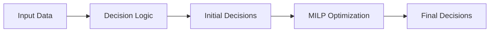
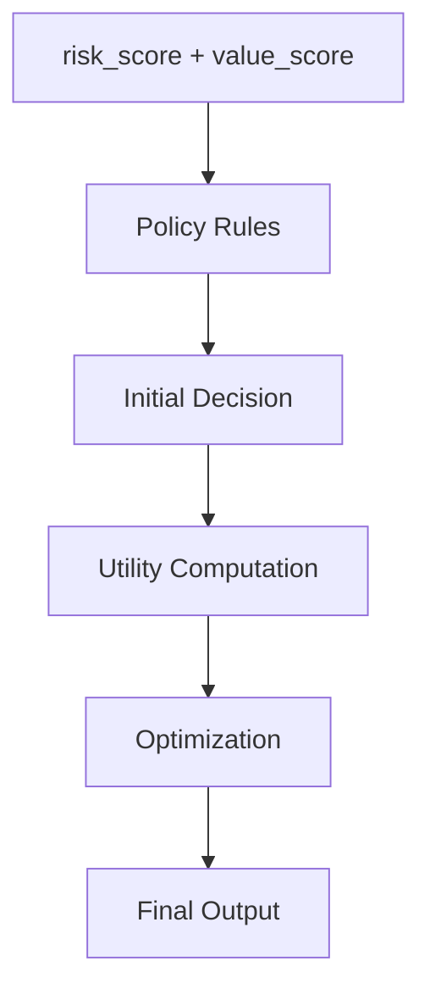

# Football Decision Engine

### Building end-to-end decision systems for football: from data to actionable insights under real-world constraints.


---

## 🚀 From Prediction → Decision → Optimization → Action

This project implements a **Decision Intelligence system** designed to support football clubs in translating predictive signals into **optimal squad-level decisions**.

Unlike traditional analytics pipelines, this system does not stop at estimating:

- player performance
- injury risk

Instead, it answers the operational question:

> **Given all available information, what should we do?**

---

## 📊 Executive Summary

The Football Decision Engine integrates:

- player value (performance contribution)
- availability risk (injury / exposure)
- squad-level constraints

to produce **actionable, explainable and optimized decisions**:

- `start`
- `limit_minutes`
- `bench`

These decisions are not made independently.

They are allocated through a **global optimization process (MILP)** that ensures consistency across the entire squad.

---

## ⭐ Key Features

| Feature | Description |
|--------|------------|
| Decision Engine | Transforms data into actions |
| Policy-driven | Fully configurable thresholds & rules |
| MILP Optimization | Globally optimal decision allocation |
| Risk-aware utility | Explicit trade-off between performance and availability |
| Explainability | Human-readable reasoning for each decision |

---

## 🛠 Tech Stack

| Layer | Tech |
|------|------|
| Language | Python |
| Data | pandas |
| Optimization | PuLP (MILP) |
| Config | JSON |
| Architecture | Modular / production-style |

---

## 📑 Table of Contents

- 📚 [Documentation](#-documentation)
- 🧠 [Project Objective](#-project-objective)
- ⚽ [Real-world Use Case (Matchday Scenario)](#-real-world-use-case-matchday-scenario)
- 🏗 [System Architecture](#-system-architecture)
- ⚙ [Decision Flow](#-decision-flow)
- 🧩 [Component Responsibilities](#-component-responsibilities)
- 📁 [Project Structure](#-project-structure)
- ▶ [Running](#-running)
- 📥 [Input Output](#-input-output)
- ⚠ [Limitations](#-limitations)
- 🚀 [Future Improvements](#-future-improvements)
- 🎯 [Why This Project](#-why-this-project)
- 👤 [Author](#-author)
- 📜 [License](#-license)

---

## 📚 Documentation

- [System Architecture](docs/architecture.md)
- [Decision Logic](docs/decision_logic.md)
- [Optimization Layer](docs/optimization.md)

---

## 🧠 Project Objective

Move from:

**Prediction → Decision**

Instead of building isolated models, this project focuses on:

- decision systems
- trade-off modeling
- optimization under constraints

---

## ⚽ Real-world Use Case (Matchday Scenario)

A club is preparing for a high-intensity match with:

- a key attacker with high injury risk
- several rotation players
- limited starting slots
- match congestion in upcoming fixtures

The staff must decide:

- who starts
- who is protected
- how to manage exposure

The engine evaluates each player using:

- `risk_score`
- `value_score`

and produces decisions such as:

| Player Profile | Decision |
|---------------|---------|
| High value + high risk | `limit_minutes` |
| High value + low risk | `start` |
| Low value | `bench` |

All decisions are optimized **jointly**, not individually.

---

## 🏗 System Architecture



---

## ⚙ Decision Flow



---

## 🧩 Component Responsibilities

| Component         | Responsibility            |
| ----------------- | ------------------------- |
| engine.py         | Orchestration             |
| decision.py       | Rule-based classification |
| policies.py       | Config validation         |
| constraints.py    | Squad constraints         |
| optimizer_milp.py | Global optimization       |

---

## 📁 Project Structure

```bash
src/
├── engine.py
├── decision.py
├── policies.py
├── constraints.py
├── optimizer_milp.py
```

---

## ▶ Running

``` bash
python run.py
```

---

## 📥 Input Output

### Input

| Column      | Description                |
| ----------- | -------------------------- |
| player_id   | Player identifier          |
| risk_score  | Injury / availability risk |
| value_score | Expected contribution      |

### Output

| Column         | Description                   |
| -------------- | ----------------------------- |
| decision       | start / limit_minutes / bench |
| reason         | Explanation                   |
| priority_score | Utility                       |

---

## ⚠ Limitations

- no match context (importance, opponent)
- no positional constraints
- no fatigue/load modeling
- static utility parameters

---

## 🚀 Future Improvements

| Version | Feature                           |
| ------- | --------------------------------- |
| v0.6    | Context-aware decisions           |
| v0.7    | Tactical constraints              |
| v0.8    | Fatigue & load modeling           |
| v1.0    | Full decision intelligence system |

---

## 🎯 Why This Project

Most football analytics projects focus on:

* prediction
* dashboards
* ranking players

This project focuses on:

> **decision-making under uncertainty**

It demonstrates the ability to:

* design systems (not just models)
* formalize trade-offs
* apply optimization to real problems

---

## 👤 Author

Manuel Pérez Bañuls/
Data Scientist | Football Analytics Enthusiast | Probabilistic Modeling

Specializing in:

* Sports analytics and forecasting
* Probabilistic simulation systems
* Machine learning for football prediction
* Production-ready data pipelines

📧 [manuelpeba@gmail.com](mailto:manuelpeba@gmail.com)

---

## 📜 License

MIT License