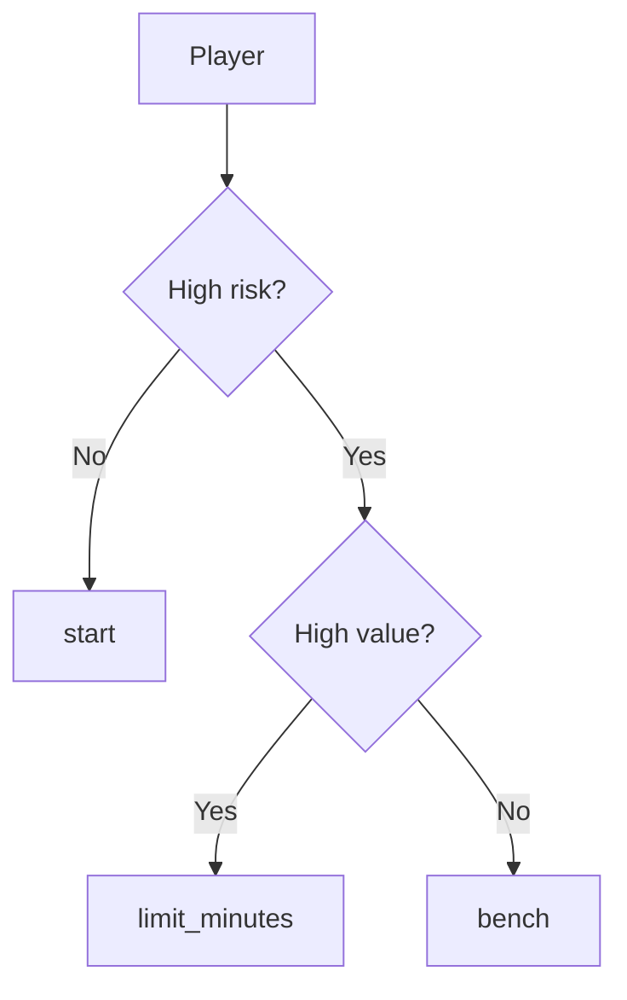

# Optimization Layer (MILP)

## 📌 Overview

The optimization layer is the core component that transforms individual player recommendations into a **globally optimal squad decision plan**.

Unlike rule-based systems, this layer ensures that decisions are:

- globally consistent
- constraint-aware
- aligned with squad-level objectives

The problem is formulated as a **Mixed Integer Linear Programming (MILP)** model.

---

## 🧠 Problem Formulation

We aim to solve:

> Assign an action to each player that maximizes total squad utility under real-world constraints.

---

## 🔢 Inputs

For each player *i*:

- `value_scoreᵢ ∈ [0,1]` → expected contribution
- `risk_scoreᵢ ∈ [0,1]` → injury / availability risk

From policy:

- `risk_penalty`
- squad constraints

---

## 📐 Base Utility Function

The system defines a risk-adjusted utility:

```math
base_scoreᵢ = value_scoreᵢ - λ · risk_scoreᵢ
```

Where:

* λ = `risk_penalty`
* controls risk aversion

---

## 🎯 Decision Variables

For each player *i*:

```math
x_{start,i}, x_{limit,i}, x_{bench,i} ∈ {0,1}
```

Subject to:

```math
x_{start,i} + x_{limit,i} + x_{bench,i} = 1
```

Each player receives exactly one action.

---

## ⚙️ Action-Specific Utility

The model defines different utilities depending on the action:

```math
U_{start,i} = base_scoreᵢ - α · risk_scoreᵢ
```

```math
U_{limit,i} = base_scoreᵢ
```

```math
U_{bench,i} = β · base_scoreᵢ
```

Where:

* α = extra penalty for risky starters
* β < 1 reduces bench contribution

---

## 🧮 Objective Function

```math
\max \sum_i \left(
U_{start,i} · x_{start,i}
+
U_{limit,i} · x_{limit,i}
+
U_{bench,i} · x_{bench,i}
\right)
```

---

## 🚧 Constraints

### 1. Limited Minutes Constraint

```math
\sum_i x_{limit,i} \leq max\_limit\_minutes
```

---

### 2. Bench Constraint

```math
\sum_i x_{bench,i} \leq max\_bench
```

---

### 3. Minimum Starters Constraint

```math
\sum_i x_{start,i} \geq min\_start
```

---

## 🧠 Interpretation

The model balances:

| Component   | Role                |
| ----------- | ------------------- |
| Value       | upside contribution |
| Risk        | downside exposure   |
| Constraints | squad feasibility   |

---

## ⚽ Football Interpretation

Typical outcomes:

| Player Type           | Decision      |
| --------------------- | ------------- |
| High value, low risk  | start         |
| High value, high risk | limit_minutes |
| Low value             | bench         |


---

## 📉 Conceptual Decision Boundary

The current system can be interpreted as a simplified decision surface over two dimensions:

- **Risk score**
- **Value score**

At a conceptual level, the policy behaves as follows:



A more football-oriented view is the following decision map:

| Risk Level | Value Level | Likely Decision                 | Football Interpretation                       |
| ---------- | ----------- | ------------------------------- | --------------------------------------------- |
| Low        | High        | `start`                         | Strong contribution with acceptable exposure  |
| Low        | Low         | `start` or low-priority starter | Available player, but with limited upside     |
| High       | High        | `limit_minutes`                 | Important player who should be protected      |
| High       | Low         | `bench`                         | Downside risk outweighs expected contribution |

### Intuition Behind the Boundary

This decision structure reflects a simple but operationally meaningful principle:

* **availability enables selection**
* **value justifies exposure**
* **risk constrains usage**

In other words:

* low-risk players are generally safe to start
* high-risk players require stronger value justification
* low-value and high-risk combinations are the clearest bench candidates

This is not yet a continuous nonlinear boundary, but it is a practical first approximation of football decision logic that remains highly interpretable.

---

## 🔢 Worked Numerical Example

### Scenario

Assume the club is preparing for a league match with the following policy parameters:

* `risk_penalty = 0.50`
* extra start risk penalty = `0.20`
* bench utility multiplier = `0.30`

We evaluate a realistic player profile:

| Variable      |           Value |
| ------------- | --------------: |
| Player        | Starting winger |
| `risk_score`  |            0.70 |
| `value_score` |            0.90 |

This represents a player with:

* very high expected contribution
* but substantial injury / availability risk

---

### Step 1 — Compute Base Score

The engine first computes:

```math
base\_score = value\_score - risk\_penalty \cdot risk\_score
```

Substituting values:

```math
base\_score = 0.90 - 0.50 \cdot 0.70
```

```math
base\_score = 0.90 - 0.35 = 0.55
```

So the player's risk-adjusted base utility is:

```text
base_score = 0.55
```

---

### Step 2 — Compute Utility for Each Action

#### Start

```math
U_{start} = base\_score - 0.20 \cdot risk\_score
```

```math
U_{start} = 0.55 - 0.20 \cdot 0.70
```

```math
U_{start} = 0.55 - 0.14 = 0.41
```

#### Limit Minutes

```math
U_{limit} = base\_score = 0.55
```

#### Bench

```math
U_{bench} = 0.30 \cdot base\_score
```

```math
U_{bench} = 0.30 \cdot 0.55 = 0.165
```

---

### Step 3 — Compare Actions

| Action          | Utility |
| --------------- | ------: |
| `start`         |   0.410 |
| `limit_minutes` |   0.550 |
| `bench`         |   0.165 |

Under these parameters, the best action is:

```text
limit_minutes
```

---

### Football Interpretation

This is exactly the type of decision a performance or coaching staff might want:

* the player is too valuable to fully bench
* the risk is too high for unrestricted starting exposure
* limiting minutes preserves upside while controlling downside

This is the core rationale behind the engine:

> not simply selecting the best player, but selecting the best action for the player under risk.

---

## 🧪 Additional Example: Low-Value High-Risk Player

Now consider a second player:

| Variable      |                Value |
| ------------- | -------------------: |
| Player        | Rotational full-back |
| `risk_score`  |                 0.80 |
| `value_score` |                 0.35 |

### Step 1 — Base Score

```math
base\_score = 0.35 - 0.50 \cdot 0.80 = 0.35 - 0.40 = -0.05
```

### Step 2 — Utilities

#### Start

```math
U_{start} = -0.05 - 0.20 \cdot 0.80 = -0.05 - 0.16 = -0.21
```

#### Limit Minutes

```math
U_{limit} = -0.05
```

#### Bench

```math
U_{bench} = 0.30 \cdot (-0.05) = -0.015
```

### Step 3 — Compare Actions

| Action          | Utility |
| --------------- | ------: |
| `start`         |  -0.210 |
| `limit_minutes` |  -0.050 |
| `bench`         |  -0.015 |

Best action:

```text
bench
```

### Interpretation

Here the system identifies a very different profile:

* high exposure
* low expected contribution
* poor justification for match involvement

This makes `bench` the most rational decision.

---

## 🧠 What These Examples Show

These examples illustrate two important properties of the model:

1. **The same risk level does not imply the same action**

   * value can justify controlled exposure

2. **The same value level does not imply the same action**

   * risk can materially change the recommendation

This is why the project is fundamentally a decision system rather than a ranking model.

---

## Multi-Match Optimization (v0.8)

The optimization problem is extended from:

`maximize utility(match)`

to:

`maximize Σ utility(match_i)`

### Additional Constraints

- fatigue accumulation across matches
- exposure balancing
- contextual value per match

### Key Difference

Single-match optimization is **myopic**.  
Multi-match optimization is **horizon-aware**.

This enables:

- strategic rotation
- protection of high-risk players
- better global outcomes

---

## 🧩 Why MILP

MILP is chosen because:

* decisions are discrete
* constraints are strict
* objective is well-defined
* global optimality is required

---

## ⚖️ Trade-offs

| Approach | Pros    | Cons         |
| -------- | ------- | ------------ |
| Rules    | Simple  | Not optimal  |
| Greedy   | Fast    | Myopic       |
| MILP     | Optimal | More complex |

---

## 🔮 Future Extensions

* positional constraints (formation-aware)
* opponent-adjusted utility
* fatigue-aware penalties
* uncertainty modeling (CVaR)

---

## 🏁 Summary

This layer elevates the system from:

> prediction → recommendation → **optimal decision-making**

It is the core element that transforms the project into a **Decision Intelligence System**.
