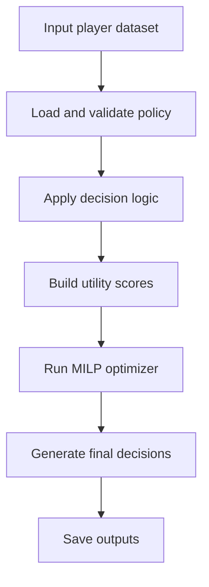

# System Architecture

## Overview

The **Football Decision Engine** is a modular decision intelligence system designed to transform player-level signals into **actionable squad decisions** under real-world football constraints.

At its core, the system answers a practical operational question:

> Given player value, risk, squad constraints and planning context, what is the best action to take?

Rather than stopping at prediction or ranking, the architecture is built to support a full decision workflow:

```text
Input signals → policy logic → optimization → squad decisions → planning layer
```

This design reflects how football organizations increasingly need to operate internally: combining performance, availability, constraints and planning horizon into a coherent decision process.

---

## Architectural Objective

The architecture is designed to support four goals:

1. **Translate analytics into actions**
   Move from player evaluation to explicit decisions such as `start`, `limit_minutes` and `bench`.

2. **Optimize globally, not locally**
   Decisions are not made independently player by player. They are allocated jointly at squad level through optimization.

3. **Remain configurable and extensible**
   Policies, thresholds, utility weights and constraints are externalized so the system can evolve without rewriting the full engine.

4. **Scale from single-match decisions to planning across time**
   The same architecture supports progression from matchday decisioning to horizon-aware multi-match planning.

---

## High-Level Architecture


### Interpretation

* **Input Data** provides player-level signals such as risk and value.
* **Policy Layer** defines thresholds, actions and configurable optimization parameters.
* **Decision Logic** translates player states into candidate decisions and decision rationale.
* **Utility Layer** converts value-risk trade-offs into optimization-ready scores.
* **MILP Optimization** allocates actions globally under squad constraints.
* **Planning Layer** extends the system from one match to multiple matches under congestion.

---

## Layered Design

### 1. Input Layer

The system begins with structured player-level data.

Typical fields include:

* `player_id`
* `risk_score`
* `value_score`

These variables are deliberately compact in the current version to keep the engine interpretable and modular. They represent the minimum viable information required to produce risk-aware football decisions.

In a production-grade setting, this layer could be extended with:

* positional eligibility
* tactical role
* opponent-adjusted value
* training load
* recovery status
* expected availability scenarios

---

### 2. Policy Layer

The policy layer externalizes decision behavior into configuration.

It defines:

* threshold logic
* action mappings
* squad-level constraints
* optimization parameters
* MILP utility weights

This is a critical architectural choice: it separates **decision design** from **code implementation**.

In practical terms, this means that the club can adjust:

* what counts as high risk
* how aggressive or conservative the engine should be
* how many starters / protected players / bench players are allowed
* how strongly risk should penalize utility

without rewriting core logic.

This makes the system:

* easier to audit
* easier to tune
* easier to adapt across contexts

---

### 3. Decision Logic Layer

The decision logic layer translates player-level signals into a first decision interpretation.

At this stage, the system applies policy-driven logic to classify players into football-relevant actions:

* `start`
* `limit_minutes`
* `bench`

This layer is intentionally explicit and interpretable.

Its function is not to produce the final squad plan in isolation, but to provide:

* action semantics
* reasoning structure
* a bridge between model outputs and optimization

This preserves explainability for technical and non-technical stakeholders.

---

### 4. Utility Layer

The utility layer converts player signals into a quantitative objective suitable for optimization.

In the current version, the base utility is defined as:

```text
base_score = value_score - risk_weight * risk_score
```

Action-specific utilities are then derived through configurable bonuses:

* `start_bonus`
* `limit_minutes_bonus`
* `bench_bonus`

This is an important architectural upgrade from earlier hardcoded logic. The optimization layer is now **config-driven**, which improves:

* reproducibility
* transparency
* experimentation
* long-term maintainability

At system level, this layer formalizes the central trade-off of the project:

> maximize contribution while managing exposure risk

---

### 5. Optimization Layer

The optimization layer is the core allocation engine.

It uses **Mixed-Integer Linear Programming (MILP)** to assign exactly one action to each player while respecting squad-level constraints.

Examples of supported constraints include:

* `min_start`
* `max_start`
* `max_limit_minutes`
* `max_bench`

Optional extensions include:

* `min_limit_minutes`
* `min_bench`

This layer ensures that decisions are made **jointly**, not independently.

That distinction is essential in football settings: the best action for one player depends on the feasible action mix for the rest of the squad.

The optimization layer therefore transforms the system from:

```text
rule-based player evaluation
```

into:

```text
squad-level decision allocation
```

---

### 6. Planning Layer

The planning layer extends the engine beyond a single match.

Instead of optimizing only for the current matchday, it allocates exposure across a multi-match horizon while considering:

* congestion
* match importance
* fatigue accumulation
* rotation needs

This changes the architecture from reactive decisioning to proactive planning.

Conceptually, the progression is:

```text
Prediction → Policy → Matchday Optimization → Multi-Match Planning
```

This planning layer is what moves the project closer to a real football operations use case rather than a static analytics demo.

---

## Core Components

The current codebase is organized around a modular package structure.

### `engine.py`

Central orchestration layer.

Responsibilities:

* load policy
* validate inputs
* execute decision logic
* invoke optimization
* return final structured outputs

This is the main entry point of the system.

---

### `decision.py`

Rule-based classification logic.

Responsibilities:

* interpret risk/value thresholds
* map player states to football actions
* generate explainable decision rationale

---

### `policies.py`

Policy loading and validation.

Responsibilities:

* load JSON policy files
* validate thresholds, actions, constraints and MILP parameters
* ensure consistency between configuration and optimizer requirements

This is an important governance component because it protects the engine from invalid configurations.

---

### `constraints.py`

Constraint support layer.

Responsibilities:

* represent squad-level action restrictions
* centralize decision feasibility logic
* support cleaner optimization interfaces

---

### `optimizer.py`

Greedy / baseline optimization support.

Responsibilities:

* provide simpler scoring and allocation logic
* support baseline comparisons against MILP
* act as a lighter optimization benchmark

Architecturally, this module is useful because it separates **baseline allocation logic** from the final exact optimizer.

---

### `optimizer_milp.py`

Exact optimization layer.

Responsibilities:

* define binary decision variables
* compute config-driven utilities
* enforce squad-level constraints
* solve the final action allocation problem

This module is the main mathematical engine of the project.

---

### `planning.py`

Planning layer scaffold for multi-match allocation.

Responsibilities:

* extend decisions across multiple matches
* support exposure scheduling logic
* evolve toward horizon-aware optimization

---

### `schemas.py`

Structure and validation support for future typed interfaces.

Responsibilities:

* support cleaner data contracts
* enable stronger validation as the project matures

---

### `utils.py`

Shared helper logic for reusable internal operations.

---

## Current Repository Structure

```bash
football-decision-engine/
├── assets/
│   └── demo/
├── docs/
│   ├── architecture.md
│   ├── decision_logic.md
│   ├── optimization.md
│   └── multi_match_planning.md
├── notebooks/
│   ├── 01_decision_boundary_elite.ipynb
│   ├── 02_matchday_simulation_elite.ipynb
│   ├── 03_lineup_optimization_elite.ipynb
│   ├── 04_multi_match_planning_elite.ipynb
│   └── README.md
├── outputs/
│   ├── csv/
│   └── figures/
├── src/
│   └── football_decision_engine/
│       ├── __init__.py
│       ├── engine.py
│       ├── decision.py
│       ├── policies.py
│       ├── constraints.py
│       ├── optimizer.py
│       ├── optimizer_milp.py
│       ├── planning.py
│       ├── schemas.py
│       └── utils.py
├── tests/
│   ├── test_decision.py
│   ├── test_engine.py
│   ├── test_optimizer_milp.py
│   └── test_policy_validation.py
├── run.py
├── requirements.txt
└── README.md
```

This structure reflects an important evolution in the project: from notebook-centric experimentation to a more production-style modular system.

---

## End-to-End Execution Flow

The current execution flow can be summarized as follows:



### Flow Explanation

1. **Input player dataset**
   A structured dataset provides `player_id`, `risk_score` and `value_score`.

2. **Load and validate policy**
   The engine loads a JSON policy and validates:

   * thresholds
   * actions
   * constraints
   * optimization parameters
   * MILP configuration

3. **Apply decision logic**
   Players are classified into candidate football actions.

4. **Build utility scores**
   Utility is computed using a configurable value-risk trade-off.

5. **Run MILP optimizer**
   The system allocates final actions globally under squad constraints.

6. **Generate final decisions**
   The output includes:

   * `decision`
   * `reason`
   * `priority_score`

7. **Save outputs**
   Results are exported for downstream analysis or presentation.

---

## Design Principles

### Separation of Concerns

Each module has a clear role: policy, logic, constraints, optimization, planning.

### Config-Driven Behavior

Decision behavior is controlled by policy files rather than hidden constants.

### Explainability

The system is designed to produce decisions that can be communicated to technical and non-technical stakeholders.

### Extensibility

The architecture is intentionally built so that future layers can be added without breaking the core design.

### Football Relevance

The architecture is structured around realistic football operations problems rather than abstract optimization alone.

---

## Implemented vs Emerging Layers

A strong architecture document should distinguish between what is already implemented in core code and what is currently more developed in notebooks.

### Implemented in the core engine

* policy loading and validation
* rule-based decision logic
* config-driven MILP optimization
* structured output generation
* modular package architecture

### More fully demonstrated in notebooks / demo layer

* formation-constrained lineup optimization
* multi-match planning scenarios
* richer visual explanations
* squad planning storytelling

This distinction is important because it preserves architectural honesty while still showing the intended system trajectory.

---

## Production-Grade Extension Path

The current architecture provides a strong base for future football-specific extensions.

### Near-term extensions

* uncertainty-aware planning
* opponent-aware value adjustment
* scenario-based availability modeling
* richer role and position constraints

### Longer-term extensions

* robust optimization under multiple recovery scenarios
* tactical game-model adaptation
* simulation-driven planning
* API/service layer for interactive decision support

---

## Architectural Takeaway

The Football Decision Engine is not structured as a simple prediction pipeline.

It is structured as a **decision system**.

That distinction matters.

The architecture is designed to move football analytics beyond isolated scoring and toward a more operational framework in which:

* data informs policy
* policy informs optimization
* optimization produces actions
* actions can then be planned across time

This is the core architectural idea behind the project.